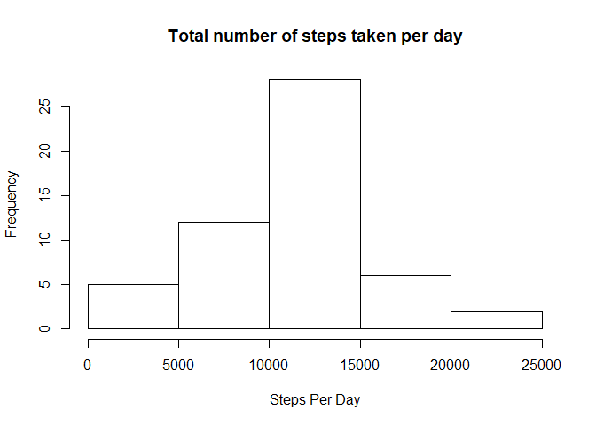
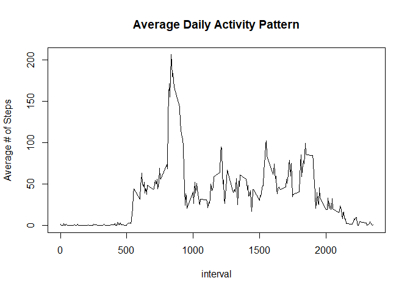
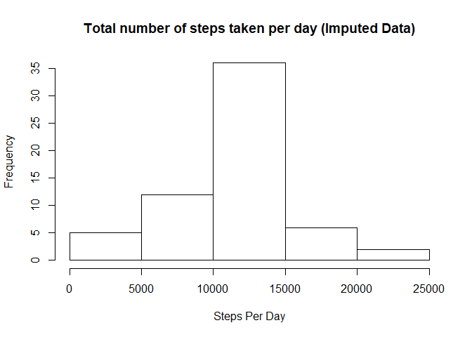
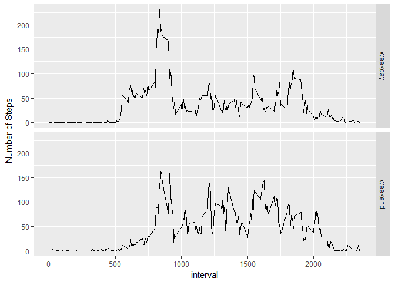

## Loading and preprocessing the data

```r
# setup global options
library(knitr)
opts_chunk$set(warning=FALSE, message=FALSE)
options(scipen = 999)

library(data.table)
library(lubridate)

# extract the data
unzip("activity.zip")

# load it in a data.table and parse date as 'date' instead of string
dt <-fread("activity.csv", na.strings = "NA")
dt[, date:= ymd(date)]
```
  
  
## What is mean total number of steps taken per day?

```r
library(dplyr)

# calculate total steps taken per day, excluding missing values
stepsPerDay <- dt[which(!is.na(steps)), ] %>%
                  group_by(date) %>%
                  summarize(total = sum(steps))

# histogram of the total number of steps taken each day
hist(stepsPerDay$total, xlab = "Steps Per Day", main = "Total number of steps taken per day")
```

<!-- -->

```r
# mean & median of the total number of steps taken per day
mean <- mean(stepsPerDay$total)
median <- median(stepsPerDay$total)
```
**Mean** of the total number of steps taken per day is **10766.1886792**  
**Median** of the total number of steps taken per day **10765**
  
  
## What is the average daily activity pattern?

```r
# average number of steps per interval across all days
avgStepsPerInterval <- dt[which(!is.na(steps)), ] %>%
                          group_by(interval) %>%
                          summarize(avg = mean(steps))

plot(avgStepsPerInterval, type="l", ylab="Average # of Steps", main="Average Daily Activity Pattern")
```

<!-- -->

```r
maxStepInterval <- avgStepsPerInterval[which.max(avgStepsPerInterval$avg), 1]
```
Interval **835** contains the maximum number of steps on average across all the days in the dataset


## Imputing missing values

```r
missingValuesCount <- sum(is.na(dt$steps))
```
There are a total of **2304** missing values in the dataset


```r
# replace missing values with the average of the steps for that interval
dt2 <- dt %>% 
          group_by(interval) %>% 
          mutate(steps = ifelse(is.na(steps), round(mean(steps, na.rm = TRUE)), steps))
dt2 <- as.data.table(as.data.frame(dt2))

# calculate total steps taken per day, excluding missing values
stepsPerDay2 <- dt2[which(!is.na(steps)), ] %>%
                  group_by(date) %>%
                  summarize(total = sum(steps))

# histogram of the total number of steps taken each day
hist(stepsPerDay2$total, xlab = "Steps Per Day", main = "Total number of steps taken per day (Imputed Data)")
```

<!-- -->

```r
# mean & median of the total number of steps taken per day
mean2 <- mean(stepsPerDay2$total)
median2 <- median(stepsPerDay2$total)
```
**Mean** of the total number of steps taken per day for *imputed dataset* is **10765.6393443**, which is **less than** the mean (10766.1886792) of the original data.  
**Median** of the total number of steps taken per day  for *imputed dataset* **10762**, which is **less than** the median (10765) of the original data.


## Are there differences in activity patterns between weekdays and weekends?

```r
dt2[, day:=ifelse(wday(date) %in% c(1,7), "weekend", "weekday")]
dt2[, day:=as.factor(day)]

avgByDayAndInterval <- dt2 %>% 
                         group_by(day, interval) %>% 
                         summarise(avg = mean(steps))

library(ggplot2)
ggplot(data=avgByDayAndInterval, aes(interval, avg)) + geom_line() + facet_grid(day ~ .) + ylab("Number of Steps")
```

<!-- -->
